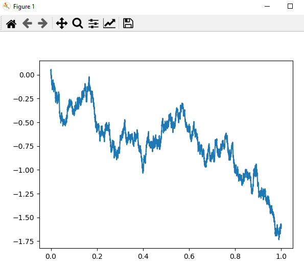
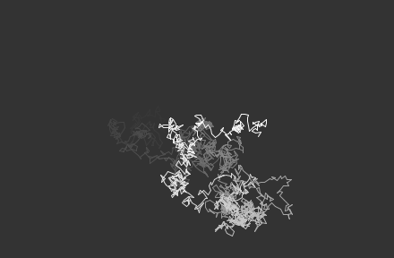

# brownian-motion
There are two projects one is a usage of brownian motion for [trading in python](./python_trading/).   
  
  
  
  
Second is a usage of brownian motion to create a [visualization in processing](./brownian_processing/).  

  
